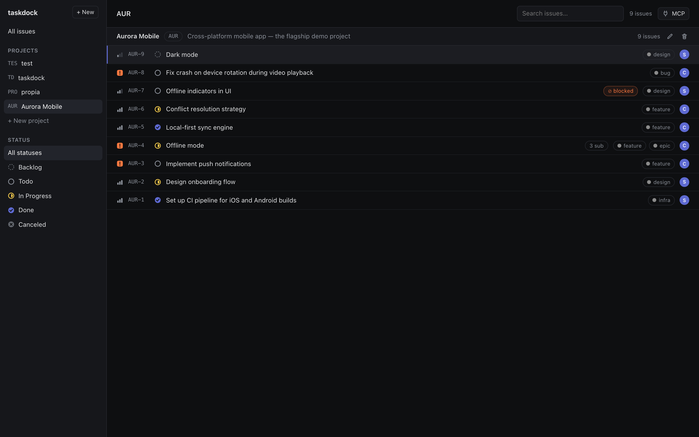
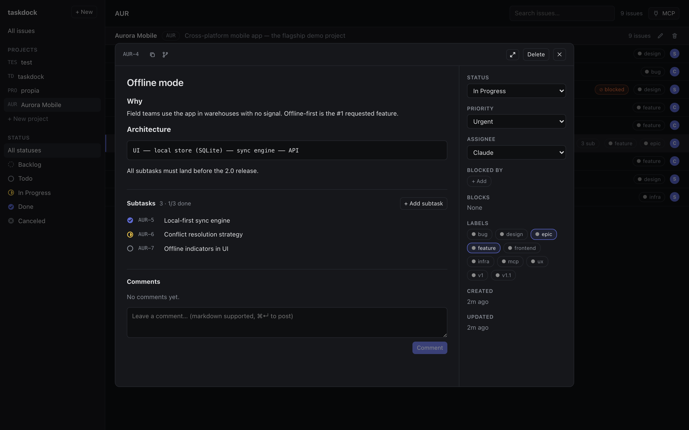
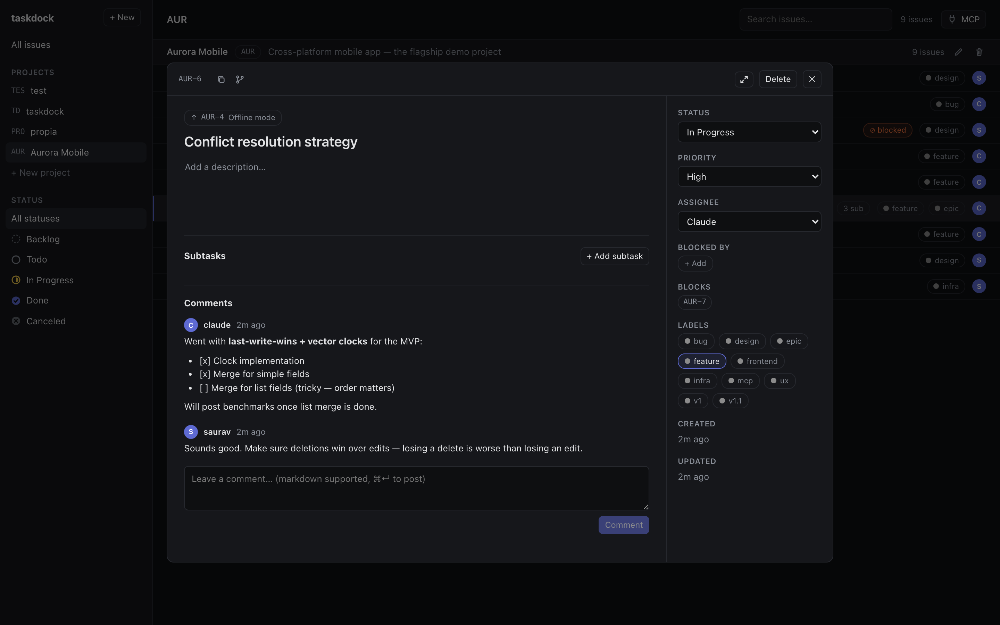
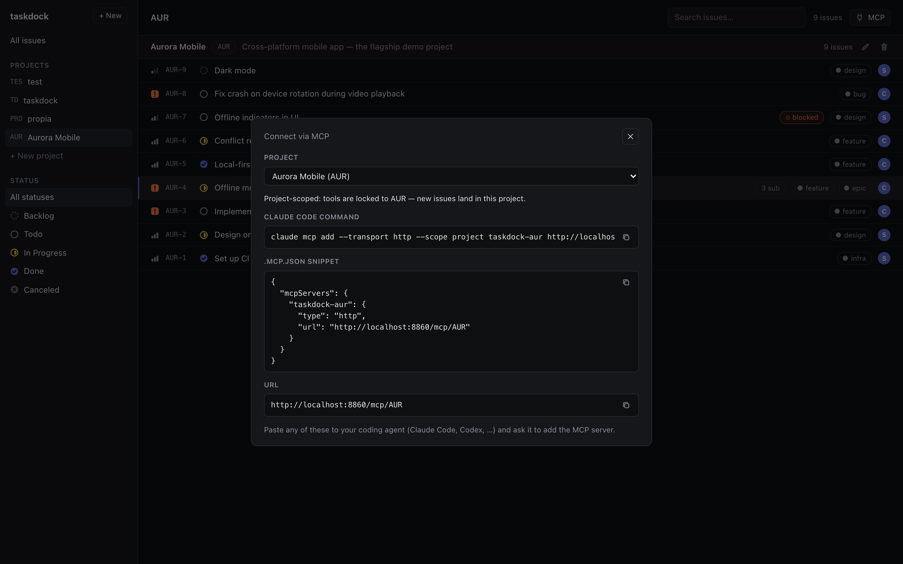

# taskdock

**A minimal, self-hosted Linear alternative with a first-class MCP server — built for working with AI coding agents.**

Track projects and issues in a fast, keyboard-driven UI, and let Claude Code (or any
MCP-capable agent) pick up tickets, log progress, and close them — straight from your
own machine. Single static Go binary, SQLite storage, **13 MB Docker image, ~4 MB idle RAM**.



## Why

Issue trackers are built for teams; taskdock is built for *you and your agents*:

- **Your data stays local** — one SQLite file, no cloud, no accounts, no auth ceremony
- **Agents are first-class users** — assign a ticket to `claude`, and a Claude Code
  session can ask *"what should I work on?"*, do the work on the right branch, and
  comment its progress back
- **Light enough to always run** — a scratch-image Go binary that idles at ~4 MB

## Features

### Issues, Linear-style

- Projects with **per-project issue keys** (`AUR-12`), statuses
  (`backlog → todo → in progress → in review → done / canceled`), five
  priority levels, labels, and assignees
- **Cycle-time stamps** — `started_at` / `completed_at` set automatically on
  the first transition into a working / terminal status
- **Markdown everywhere** — descriptions and comments use a Tiptap editor with
  full markdown round-tripping
- **Paste images** straight into the editor — stored locally, rendered inline
- **Subtasks** (parent/child) and **dependencies** (blocked by / blocks) with
  circular-reference protection



### Built for keyboard

`c` new issue · `j`/`k` navigate · `Enter` open · `f` fullscreen · `Esc` close —
plus one-click copy for the issue key and a **generated git branch name**
(`aur-6-conflict-resolution-strategy`).



### MCP server built in

Every taskdock instance exposes an MCP endpoint (JSON-RPC 2.0 over HTTP) — no
extra process, no sidecar. Connect Claude Code in one line:

```bash
claude mcp add --transport http taskdock http://localhost:8860/mcp
```

| Tool | Purpose |
|---|---|
| `taskdock_get_next_task` | Highest-priority open issue for an assignee — **skips blocked issues** |
| `taskdock_get_issue` | Full issue + comments as markdown, **with pasted images as real image blocks the model can see** |
| `taskdock_list_issues` | Filter by project / status (single or array, e.g. `["in_progress", "in_review"]`) / assignee / text |
| `taskdock_save_issue` | Create or update — title, status, priority, labels, parent, dependencies |
| `taskdock_save_comment` | Log progress on a ticket (default author: `claude`) |
| `taskdock_save_link` | Attach a URL — e.g. the PR an agent just opened for the ticket |
| `taskdock_delete_issue` | Delete by key |
| `taskdock_list_projects` | List projects |

Every issue payload includes a ready-made `branch` field (prefix configurable
via `TASKDOCK_BRANCH_PREFIX`, default `feature/` in Docker), so the agent
workflow is:

```
get_next_task → git checkout -b feature/aur-8-fix-crash-on-device-rotation
             → work → save_link {PR url} → save_comment → save_issue {status: done}
```

**Migrating from another tracker?** `save_issue` (and `POST /api/issues`)
accept an explicit `number` on creation, so imported issues keep their
original keys (`951` → `PRO-951`) — the per-project counter automatically
continues past the highest imported number, and numbers are never reused
after deletion.

### Project-scoped MCP

Add `taskdock-aur` to one repo and `taskdock-web` to another: the **MCP** button
(top right) generates a per-project config. Tools connected through
`/mcp/AUR` are locked to that project — listing, next-task, and new issues all
stay inside it, and foreign issue keys are rejected.



### Agents can see your screenshots

Paste a screenshot of a bug into a ticket. When an agent reads that ticket over
MCP, the image arrives as an actual base64 image block — the model *looks at*
the screenshot, instead of seeing a dead URL.

## Quick start

```bash
git clone git@github.com:Saurav-Paul/taskdock.git
cd taskdock
docker compose up --build -d
# → http://localhost:8860
```

Data (SQLite + uploaded images) persists in `./data`. Production compose with a
prebuilt image: `docker-compose.prod.yml`.

> **Note:** taskdock has no authentication by design — run it on localhost or a
> trusted LAN. Users are plain rows (`saurav`, `claude`), there to make
> assignment and attribution work.

## REST API

Everything the UI does goes through `/api` — usable directly:

```
GET/POST   /api/projects            GET/PATCH/DELETE /api/projects/:key
GET/POST   /api/issues              GET/PATCH/DELETE /api/issues/:key
GET/POST   /api/issues/:key/comments
GET/POST   /api/users               GET/POST         /api/labels
POST       /api/attachments         GET              /api/health
```

Issues are addressed by key (`AUR-12`), PATCHes are partial, and lists filter
via query params: `/api/issues?project=AUR&status=todo&assignee=claude&q=crash`.

## Development

```bash
go run ./cmd/server          # backend on :8860 (migrations run automatically)
cd frontend && npm run dev   # UI on :8861, proxies /api, /mcp, /files
```

## Stack

| Layer | Choice |
|---|---|
| Backend | Go — Echo, GORM, SQLite, Goose migrations embedded via `go:embed` |
| MCP | Hand-rolled JSON-RPC 2.0 (protocol `2024-11-05`), no external MCP lib |
| Frontend | React + Vite + TypeScript, Tiptap editor |
| Packaging | Multi-stage Docker build → `scratch` image (~13 MB) |
